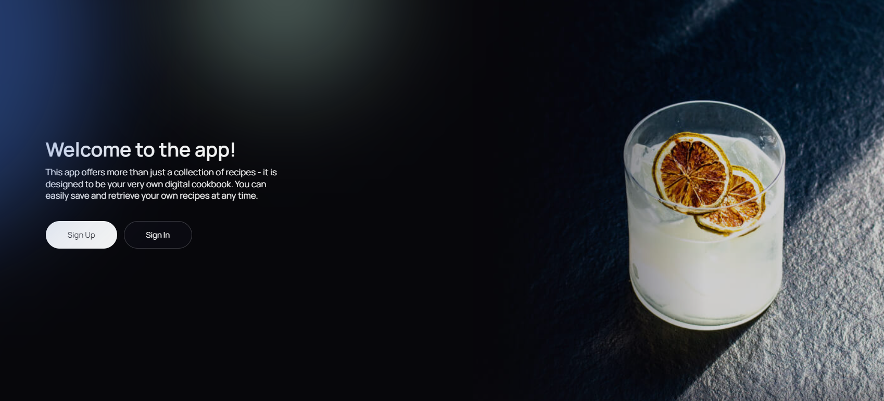

#  DrinkMaster

## 

---

## Project Overview 🍹

This is my personal project,[Drink Master ](https://drink-master-psi.vercel.app/signup), developed to showcase a full-cycle web application, including both frontend and responsive backend development. The platform is designed for cocktail enthusiasts who appreciate the culture and variety of beverages. It provides seamless access to an extensive library of drinks, allowing users to search, browse, and explore a wide range of options.

Key features include the ability to save favorite cocktails, create personalized drink recipes, and navigate an intuitive interface optimized for all devices 📱💻. The project highlights my expertise in building a robust full-stack solution, ensuring a responsive and efficient user experience 🌟.

---

### 🗂 Contents

1. [Project Overview 🍸](#project-overview)
2. [Backend ⚙️](#backend)
3. [Functionality 🚀](#functionality)
4. [Getting Started 🛠️](#getting-started)
5. [Technologies 💡](#technologies)

---

## Backend ⚙️

[Backend Deployment: Live Server 🌍](https://drinkmaster-backend-xthk.onrender.com)
[API Documentation: Swagger Docs 📄]( https://drinkmaster-backend-xthk.onrender.com/api-docs/)

---

## Functionality 🚀

Our application offers a range of convenient features that allow you to enjoy a
personalized experience and contribute to the community.

- **🔐 User Authentication:** Easily create and manage your personal account to unlock
  a tailored user experience.
- **🍹 Custom Drink Recipes:** SShare your unique cocktail recipes with the community 
  by adding them to our drink library.
- **🔍 Advanced Drink Search:**  Effortlessly search for drinks using multiple criteria 
  such as name, ingredients, or drink type.
- **📖 Recipe Details:** Access detailed information about drinks, including a list of ingredients,
  preparation instructions, and vibrant images.
- **❤️ Favorites Management:** Save your favorite cocktails in a dedicated list, ensuring quick access 
  to your preferred beverages at any time.
- **📝 Personal Contributions:** Contribute to the growing library by adding your own
 custom drink recipes. Include the name, ingredients, and preparation steps to share your 
 creations with other users and enrich our collection.

---

## Getting Started

Clone the repository: git clone `https://github.com/Marchenko1997/DrinkMaster-`
Install dependencies: `npm install` Run the application: `npm run dev`

## Technologies 🛠️

This project was built using [Vite](https://vitejs.dev/) ⚡ and [React](https://reactjs.org/) ⚛️. Below is a list of the core technologies and tools used:

##### **Frontend:**

- **⚛️ [React](https://reactjs.org/)** - JavaScript library for building user interfaces.
- **🛡️ [Redux](https://redux.js.org/)** - State container for JavaScript applications.
- **🌐 [HTML5](https://developer.mozilla.org/en-US/docs/Web/Guide/HTML/HTML5)** - Latest version of the markup language for creating web pages.
- **🎨 [CSS3](https://developer.mozilla.org/en-US/docs/Archive/CSS3)** - Latest version of the style sheet language for styling web pages.
- **✨ [Styled Components](https://styled-components.com/)** - Library for writing CSS in JavaScript for React components.
- **💻 [JavaScript](https://developer.mozilla.org/en-US/docs/Web/JavaScript)** - Programming language for implementing dynamic behavior on web pages.
- **🐙 [GitHub](https://github.com/)** - Web platform for storing and collaborating on code.

##### **Backend:**

- **🟢 [NodeJS](https://nodejs.org/)** - JavaScript runtime environment on the server side.
- **🗄️ [MongoDB](https://www.mongodb.com/)** - NoSQL database for storing application data.
- **📖 [Swagger](https://swagger.io/)** - Tool for API documentation and testing.
- **🐙 [GitHub](https://github.com/)** - Web platform for version control and code collaboration.

---

## **Contact Information** 📬

- **👩‍💻 Halyna Marchenko**
- **✉️ Email:** [marchenkohalyna888@gmail.com](mailto:marchenkohalyna888@gmail.com)
- **🔗 LinkedIn:** [Halyna Marchenko](https://www.linkedin.com/in/halyna-marchenko/)

